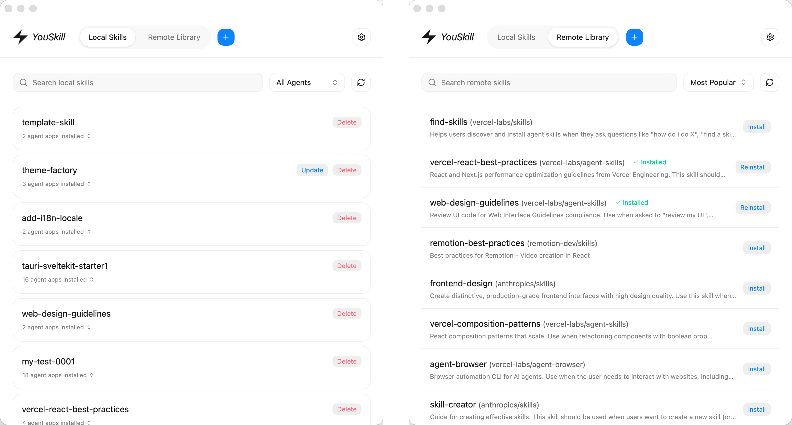
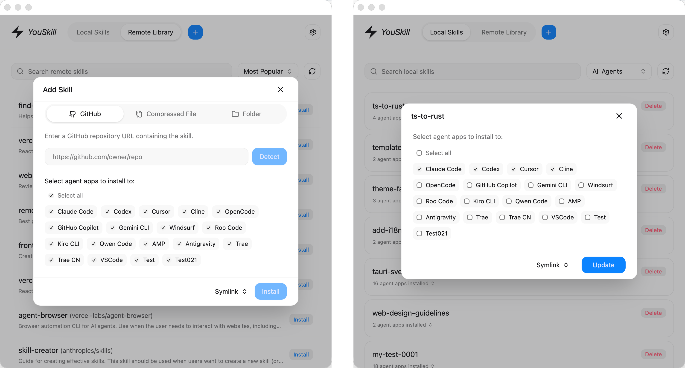
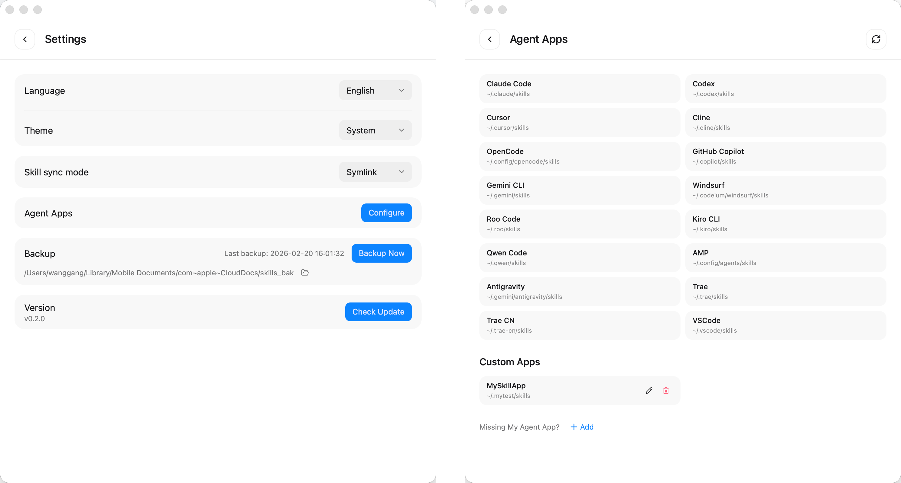

# YouSkill

这是一个桌面端 [Agent Skills](https://agentskills.io/) 管理工具，帮助你统一管理电脑上的 Skills。它体积小、启动快，目标是把 Skills 管理这件事做得清晰、可视、可维护。

## 为什么做这个项目

1. 日常会同时使用多个 Agent 应用（Codex、Claude Code、Cursor、OpenCode、TRAE 等），Skills 互相隔离且管理方式不统一。
2. Skill 的安装、更新、删除常常需要在多个目录之间手动拷贝、查找和同步，规模一大就容易混乱。
3. 对普通用户来说，手动安装或纯 CLI 使用门槛偏高，缺少直观的图形化管理工具。
4. 优秀 Skill 资源分散，查找、学习和复用成本较高。

## 功能概览

1. 支持 20+ 主流编程工具的 Skill 安装，并支持自定义 Agent 应用。
2. 兼容 Vercel `skill add` 规则与目录（以 `.agents/skills` 作为统一标准目录）。
3. 支持自动检查更新，并可一键更新 Skill。
4. 内置动态 Skill 市场（15000+ 条目），可在应用内快速检索和安装。
5. 支持从 Skill 市场、GitHub 地址、本地压缩包（`.zip` / `.skill`）和本地文件夹安装。
6. 支持 Skill 一键备份。
7. 支持软链接（Symlink）和复制（Copy）两种同步模式，实现“一处修改，多处生效”。
8. 支持多主题和多语言。

## 预览





## 下载安装

从 [Releases](https://github.com/wanggang316/you-skill/releases) 页面下载对应平台的安装包：

- **macOS**: `YouSkill_x.x.x_aarch64.dmg` (Apple Silicon) / `YouSkill_x.x.x_x64.dmg` (Intel)
- **Windows**: `YouSkill_x.x.x_x64-setup.exe`

## 技术栈

- **Tauri v2**
- **Svelte 5**
- **Vite**
- **Tailwind CSS**
- **Lucide Icons**

## 项目结构

- `src/`: 前端核心目录
- `src-tauri/`: Rust 后端与打包配置
- `scripts/`: 发布与维护脚本

## 开发

### 前置要求

- [Node.js](https://nodejs.org/) (建议 18+)
- [Rust](https://www.rust-lang.org/tools/install)
- [Tauri 依赖环境](https://tauri.app/start/prerequisites/)

### 安装依赖

```bash
npm install
```

### 本地运行

```bash
npm run tauri -- dev
```

### 构建

```bash
npm run build
npm run tauri -- build
```

### 开发规则

[AGENTS.md](AGENTS.md)

## 贡献

[CONTRIBUTING.md](CONTRIBUTING.md)

## 许可证

MIT
