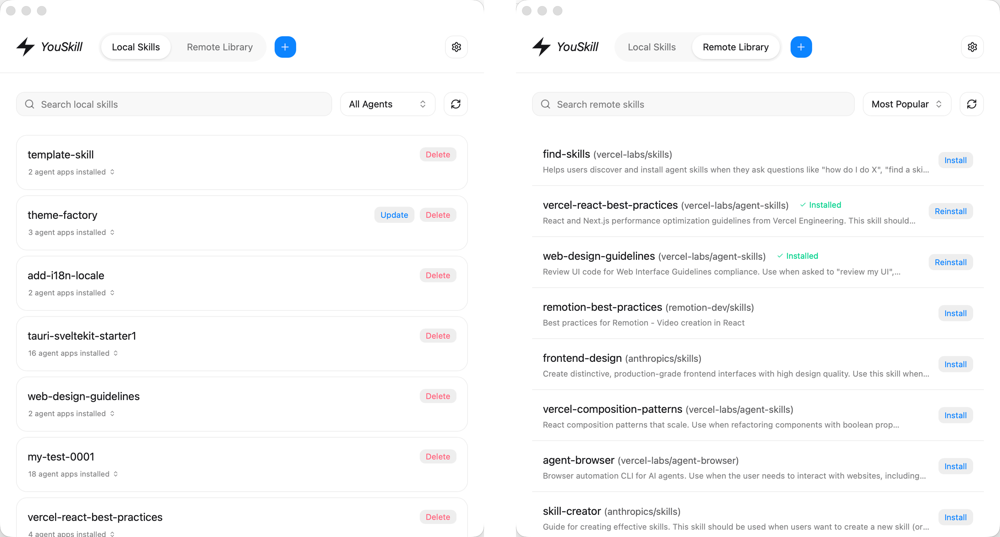
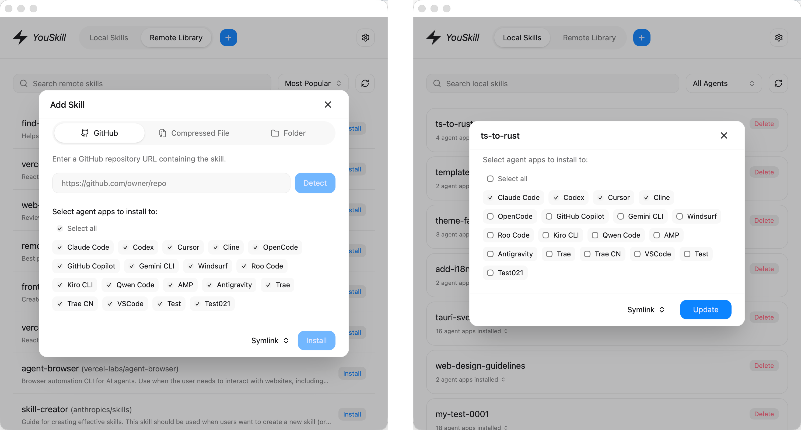
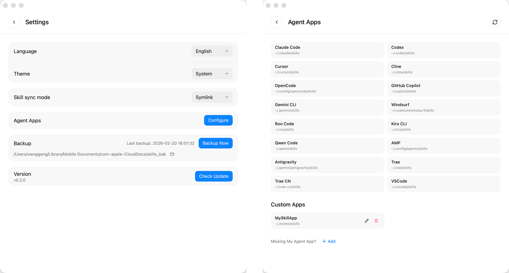

# YouSkill

[](https://github.com/wanggang316/you-skill/releases)
[](https://github.com/wanggang316/you-skill/releases)
[](https://tauri.app/)

[English](README.md) | 中文

这是一个桌面端 [Agent Skills](https://agentskills.io/) 管理工具，帮助你统一管理电脑上的 Skills。它体积小、启动快，目标是把 Skills 管理这件事做得清晰、可视、可维护。

## 为什么做这个项目

1. 日常会同时使用多个 Agent 应用（Codex、Claude Code、Cursor、OpenCode、TRAE 等），Skills 互相隔离且管理方式不统一。
2. Skill 的安装、更新、删除常常需要在多个目录之间手动拷贝、查找和同步，规模一大就容易混乱。
3. 对普通用户来说，手动安装或纯 CLI 使用门槛偏高，缺少直观的图形化管理工具。
4. 优秀 Skill 资源分散，查找、学习和复用成本较高。

## 功能概览

1. 中心化 Skill 库：所有 Skill 只导入一次，统一存放在 `~/.youskill/skills`，由唯一的 `~/.youskill/.skill-lock.json` 管理。
2. 两步式工作流：先「导入」（Skill 市场、GitHub 地址、`.zip` / `.skill` 压缩包、本地文件夹），再「安装」到 40+ 主流编程工具或自定义 Agent 应用的用户级 / 项目级目录，支持复制与软链接。
3. 安装矩阵：一眼看清每个 Skill 安装到了哪些项目、哪些 Agent。
4. 变更追踪：每个安装位置都记录它所基于的中心库版本，因此能区分「落后」「本地修改」「冲突」，并由你选择同步方向（从来源更新、推送到目标、采纳本地副本）。
5. 文件夹扫描：扫描项目目录或某个 Agent 的 skills 目录，把找到的 Skill 同步进中心库。
6. 内置动态 Skill 市场（15000+），并可对照来源仓库检查更新。
7. 兼容 `.agents/skills` 共享目录约定（即「Agents (shared)」目标）。
8. 一键备份整个中心库，支持多主题和多语言。

存储布局、lock 文件与变更模型见 [docs/ARCHITECTURE.md](docs/ARCHITECTURE.md)。

## 预览





## 下载安装

从 [Releases](https://github.com/wanggang316/you-skill/releases) 页面下载对应平台的安装包：

- **macOS**: `YouSkill_x.x.x_aarch64.dmg` (Apple Silicon) / `YouSkill_x.x.x_x64.dmg` (Intel)
- **Windows**: `YouSkill_x.x.x_x64-setup.exe`

## 技术栈

- **Tauri v2**
- **Svelte 5**
- **Vite**
- **Tailwind CSS**
- **Lucide Icons**

## 项目结构

- `src/`: 前端核心目录
- `src-tauri/`: Rust 后端与打包配置
- `scripts/`: 发布与维护脚本

## 开发

### 前置要求

- [Node.js](https://nodejs.org/) (建议 18+)
- [Rust](https://www.rust-lang.org/tools/install)
- [Tauri 依赖环境](https://tauri.app/start/prerequisites/)

### 安装依赖

```bash
npm install
```

### 本地运行

```bash
npm run tauri -- dev
```

### 构建

```bash
npm run build
npm run tauri -- build
```

### 发布

1. 在 [CHANGELOG.md](CHANGELOG.md) 的 `[Unreleased]` 部分填写本次更新内容
2. 执行发布脚本：
   ```bash
   npm run release <version>
   ```
   示例：`npm run release 0.9.0`

### 开发规则

[AGENTS.md](AGENTS.md)

## 路线图

- [x] 项目级的 Skill 管理
- [x] 中心化 Skill 库，支持变更追踪与文件夹扫描
- [x] Skill 详情，支持快速查看所有 Skill 文件
- [ ] 备份到 GitHub，实现多设备同步
- [ ] 基于 AI 的 FindSkill

## 贡献

[CONTRIBUTING.md](CONTRIBUTING.md)

## 许可证

MIT
